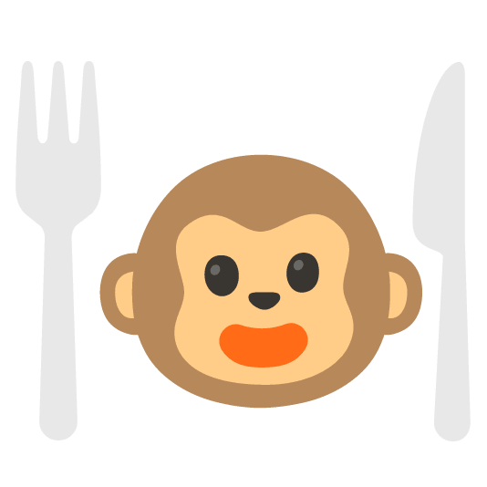

[comment]: <> (readme template taken from https://github.com/othneildrew/Best-README-Template/blob/master/README.md)

<!-- PROJECT SHIELDS -->
<!--
*** I'm using markdown "reference style" links for readability.
*** Reference links are enclosed in brackets [ ] instead of parentheses ( ).
*** See the bottom of this document for the declaration of the reference variables
*** for contributors-url, forks-url, etc. This is an optional, concise syntax you may use.
*** https://www.markdownguide.org/basic-syntax/#reference-style-links
-->
[![Contributors][contributors-shield]][contributors-url]
[![Forks][forks-shield]][forks-url]
[![Stargazers][stars-shield]][stars-url]
[![Issues][issues-shield]][issues-url]
[![MIT License][license-shield]][license-url]

<!-- PROJECT LOGO -->
 

  

<h3 align="center">Love @ First Bite</h3>

  

    A dating app for restaurants! Find the foods you love without the need to think!
     
    <a href="https://github.com/tusmm/Love-FirstBite"><strong>Explore the docs »</strong></a>
     
     
    <a href="https://github.com/tusmm/Love-FirstBite">View Demo</a>
    ·
    <a href="https://github.com/tusmm/Love-FirstBite/issues">Report Bug</a>
    ·
    <a href="https://github.com/tusmm/Love-FirstBite/issues">Request Feature</a>
  

<!-- TABLE OF CONTENTS -->

  
Table of Contents

  <ol>
    <li>
      <a href="#about-the-project">About The Project</a>
      <ul>
        <li><a href="#built-with">Built With</a></li>
      </ul>
    </li>
    <li>
      <a href="#getting-started">Getting Started</a>
      <ul>
        <li><a href="#prerequisites">Prerequisites</a></li>
      </ul>
    </li>
    <li><a href="#usage">Usage</a></li>
    <li><a href="#license">License</a></li>
  </ol>

<!-- ABOUT THE PROJECT -->
## About The Project

[![Product Name Screen Shot][product-screenshot]](https://example.com)

(<a href="#readme-top">back to top</a>)

### Built With

* [![React][React.js]][React-url]
* [![ReactNative][ReactNative.js]][ReactNative-url]
* [![Firebase][Firebase.com]][Firebase-url]

(<a href="#readme-top">back to top</a>)

<!-- GETTING STARTED -->
## Getting Started

This is an example of how you may give instructions on setting up your project locally.
To get a local copy up and running follow these simple example steps.

### Prerequisites

This is an example of how to list things you need to use the software and how to install them.
// list dependecies

<!-- USAGE EXAMPLES -->
## Usage

Use this space to show useful examples of how a project can be used. Additional screenshots, code examples and demos work well in this space. You may also link to more resources.

_For more examples, please refer to the [Documentation](https://example.com)_

(<a href="#readme-top">back to top</a>)

<!-- LICENSE -->
## License

Distributed under the MIT License. See `LICENSE.txt` for more information.

(<a href="#readme-top">back to top</a>)

<!-- MARKDOWN LINKS & IMAGES -->
<!-- https://www.markdownguide.org/basic-syntax/#reference-style-links -->
[contributors-shield]: https://img.shields.io/github/contributors/tusmm/Love-FirstBite.svg?style=for-the-badge
[contributors-url]: https://github.com/tusmm/Love-FirstBite/graphs/contributors
[forks-shield]: https://img.shields.io/github/forks/tusmm/Love-FirstBite.svg?style=for-the-badge
[forks-url]: https://github.com/tusmm/Love-FirstBite/network/members
[stars-shield]: https://img.shields.io/github/stars/tusmm/Love-FirstBite.svg?style=for-the-badge
[stars-url]: https://github.com/tusmm/Love-FirstBite/stargazers
[issues-shield]: https://img.shields.io/github/issues/tusmm/Love-FirstBite.svg?style=for-the-badge
[issues-url]: https://github.com/tusmm/Love-FirstBite/issues
[license-shield]: https://img.shields.io/github/license/tusmm/Love-FirstBite.svg?style=for-the-badge
[license-url]: https://github.com/tusmm/Love-FirstBite/blob/master/LICENSE.txt

[product-screenshot]: images/screenshot.png

[React.js]: https://img.shields.io/badge/React-20232A?style=for-the-badge&logo=react&logoColor=61DAFB
[React-url]: https://reactjs.org/

[ReactNative.js]: https://img.shields.io/badge/ReactNative-10746D?style=for-the-badge&logo=react&logoColor=61DAFB
[ReactNative-url]: https://reactnative.dev/

[Firebase.com]:  https://img.shields.io/badge/Firebase-6F653D?style=for-the-badge&logo=firebase&logoColor=FFCA28
[Firebase-url]: https://firebase.google.com/
